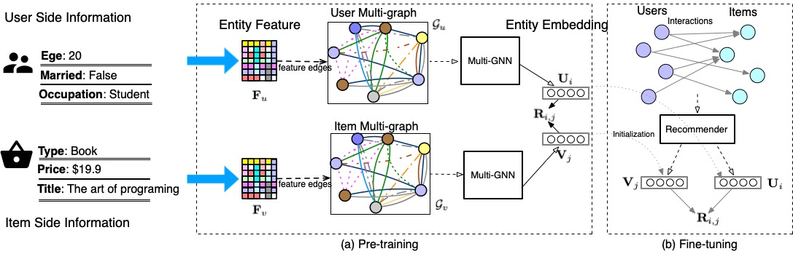

# Enhancing Recommendation Systems with Multi-Graph Pre-Training
> Codes for the submission: Enhancing Recommendation Systems with Multi-Graph Pre-Training

## Introduction

Leveraging the side information associated with entities (i.e. users and items) to enhance recommendation systems has been widely recognized as an essential modeling dimension. Most of the existing approaches address this task by the integration-based scheme, which incorporate the entity side information by combining the recommendation objective with an extra side information-aware objective. Despite of the growing progress made by the existing integration-based approaches, they are largely limited by the potential conflicts between the two objectives. Moreover, the heterogeneous side information among entities is still under-explored in these systems. In this paper, we propose a novel pre-training scheme to leverage the entity side information by pre-training entity embeddings using the multi-graph neural network. Instead of jointly training with two objectives, our pre-training scheme first pre-trains two representation models under the entity multi-graphs constructed by their side information, and then fine-tunes their embeddings under an existing general representation-based recommendation model. Our proposed multi-graph neural network can generate within-entity knowledge- encapsulated embeddings, while capturing the heterogeneity from the entity side information simultaneously, thereby improving the performance of the underlying recommendation model. An extensive evaluation of our pre-training scheme fine-tuned under four general representation-based recommender models, namely, MF, NCF, NGCF and LightGCN, shows that effectively pre-training embeddings with both the user’s and item’s side information can significantly improve these original models in terms of both effectiveness and stability.



An overview of our graph neural pre-training scheme. Our pre-training model constructs two multi-graphs based on the feature of entities, and pre-trains the embeddings of entities by using two multi-graph neural networks (Multi-GNNs).

## Requirements

To install the required packages, please run:

``` python
pip install -r requirements.txt
```
Note that the Compositional-GCN requires some components from [PyTorch Geometric](https://pytorch-geometric.readthedocs.io/en/latest/index.html), where the installation of it can be found from [here](https://pytorch-geometric.readthedocs.io/en/latest/notes/installation.html) 

## Get Started

To run a quick example of Matrix Factorizaion for using the pretrained weight, you can go to the [example](./example) folder, and run:

```python
python train_gnn_mf.py --dataset ml_100k --lr 0.01 --emb_dim 64
python train_compgcn_mf.py --dataset ml_100k --lr 0.005 --emb_dim 64 --late_dim 64 --n_base 5
```
where the configurations can be set via [gnn_mf_default.json](./configs/gnn_mf_default.json).

To pretrain a new weights with our COM-P (or GCN-P), you can go to the [example](./example) folder, and run:

```python
python train_compgcn.py
python train_gnn.py
```
with the default configuration saved in [gnn_mf_default.json](./configs/gnn_mf_default.json). You can change the default values in the configuration file or create a new one.

We have also pre-trained some weights for both GCN and COMPGCN models for each dataset, saved in [pre_train_weight](./pre_train_weight/), feel free to reload these pre-trained weights.


To train a baseline model, e.g. Neural Graph Collaborative Filtering, with default configurations, you can run

```python
python train_ngcf.py
```

If you want to change training configurations, such as the used dataset and the range of hyper-paramters, you can change the default NGCF configuration file or create a new one.

### Pre-training models
* GCN-P:[train_gcn.py](./examles/train_gcn.py), which is built based on [GCN](https://arxiv.org/pdf/1609.02907.pdf)
* Multi-P:[train_multi.py](./examles/train_multi.py), which is built based on [Compositional-GCN](https://arxiv.org/pdf/1911.03082.pdf)

### Fine-tuning models/baselines
* [MF](https://arxiv.org/pdf/2005.09683.pdf): [train_mf.py](./examles/train_mf.py)
* [NGCF](https://arxiv.org/pdf/1905.08108.pdf): [train_ngcf.py](./examles/train_ngcf.py)
* [LightGCN](https://arxiv.org/pdf/2002.02126.pdf): [train_lightgcn.py](./examles/train_lightgcn.py)
* [NCF](https://arxiv.org/pdf/1708.05031.pdf): [train_ncf.py](./examles/train_ncf.py)

To try new datasets, you can ceate a new dataset script in beta-rec/datasets by referring to how the movielens dataset is dealt with.
To define a new model, you can ceate a new model script in beta-rec/models by referring to how the NGCF model is defined.


If you have any issue about the reproducibility of this work, please feel free to raise your issues with an anonymous user, we will reply them as soon as possible.
